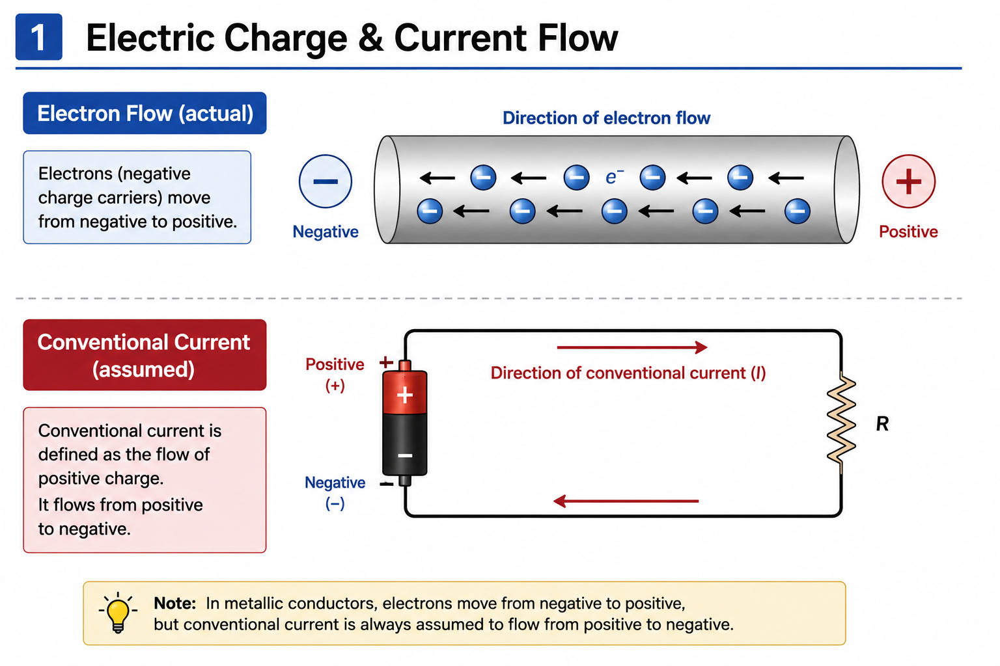
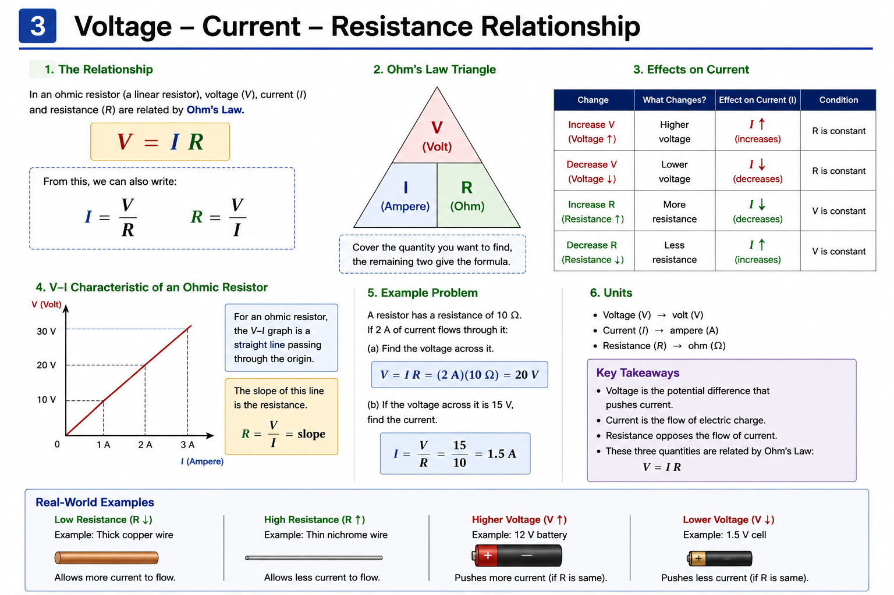
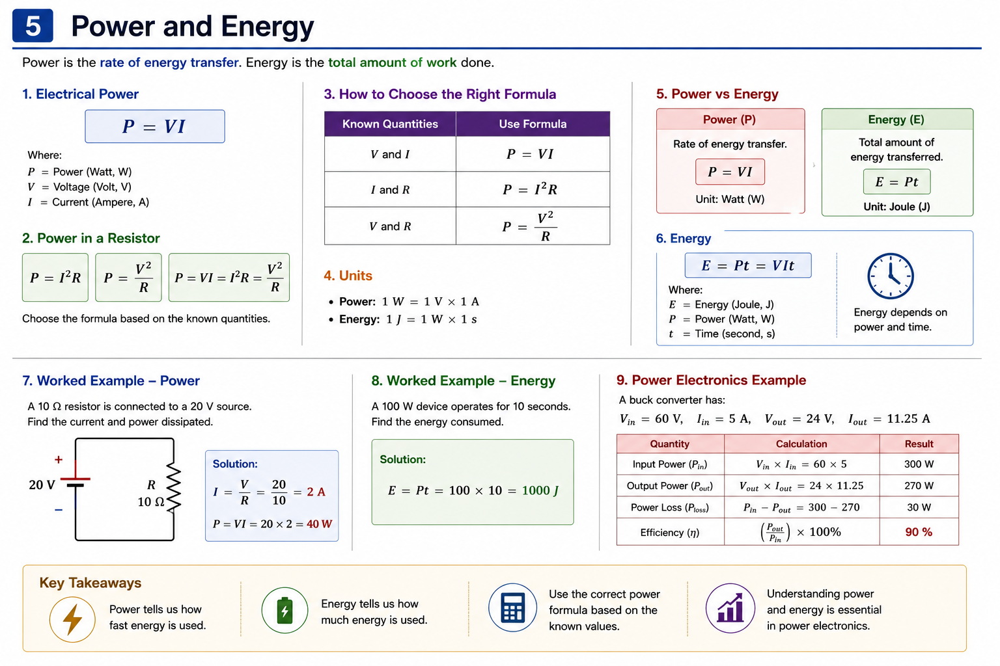

# Electrical Basics

## Objective

Understand the fundamental concepts of electric charge, current,
voltage, resistance, electrical power and energy.

These concepts form the foundation for understanding electrical
circuits and power-electronics systems.

---

# 1. What is Electricity?

## 1.1 Electric Charge

Electricity is associated with the behavior and movement of electric
charge.

The fundamental charge carrier in metallic conductors is the electron.

The charge of an electron is approximately:

$$
q_e = -1.602 \times 10^{-19}\ C
$$

Electric charge is measured in **coulombs (C)**.

---

## 1.2 Electric Current

Electric current describes the rate at which electric charge flows.

$$
I = \frac{dQ}{dt}
$$

For constant current:

$$
I = \frac{Q}{t}
$$

Where:

| Symbol | Meaning | Unit |
|---|---|---|
| $I$ | Current | A |
| $Q$ | Charge | C |
| $t$ | Time | s |

Therefore:

$$
1A = 1C/s
$$

### Example

If 5 C of charge passes through a conductor in 1 second:

$$
I = \frac{5}{1} = 5A
$$

---

## 1.3 Conventional Current vs Electron Flow

In metallic conductors:

- Electrons move from negative to positive.
- Conventional current is defined from positive to negative.
- Circuit analysis normally uses **conventional current**.

### Electron Flow and Conventional Current

The diagram below illustrates the difference between actual electron
movement and the assumed direction of conventional current.

  

As shown:

- **Electron flow:** negative → positive
- **Conventional current:** positive → negative

This distinction is important when interpreting circuit diagrams and
current directions.

---

## 1.4 Voltage and Energy

Voltage represents the electric potential difference between two points.

It can be expressed as energy per unit charge:

$$
V = \frac{W}{Q}
$$

Therefore:

$$
1V = 1J/C
$$

Voltage provides the potential difference that can drive current
through a circuit.

---

# 2. Voltage, Current and Resistance

## 2.1 Voltage

Voltage is the **electric potential difference between two points**.

It can be expressed as the energy or work required per unit charge:

$$
V = \frac{W}{Q}
$$

Where:

- $V$ = voltage [V]
- $W$ = work / energy [J]
- $Q$ = electric charge [C]

Therefore:

$$
1V = 1J/C
$$

### Physical Meaning

A voltage of **1 V** means that **1 joule of energy is associated with
each coulomb of charge** between two points.

Voltage always exists **between two points**, rather than at a single
point in isolation.

### Voltage Across a Resistor

The voltage across a component can be expressed as the potential
difference between its two terminals:

$$
V_{AB} = V_A - V_B
$$

  

In the example above, $V_{AB}$ represents the potential at point $A$
relative to point $B$.

If 10 J of energy is required to move 2 C of charge between the two
points:

$$
V_{AB} = \frac{W}{Q}
$$

$$
V_{AB} = \frac{10}{2} = 5V
$$

Therefore:

$$
\boxed{V_{AB}=5V}
$$

---

## 2.2 Current

Current is the **rate of flow of electric charge**:

$$
I = \frac{dQ}{dt}
$$

For constant current:

$$
I = \frac{Q}{t}
$$

Where:

| Symbol | Meaning | Unit |
|---|---|---|
| $I$ | Current | A |
| $Q$ | Charge | C |
| $t$ | Time | s |

Therefore:

$$
1A = 1C/s
$$

### Physical Meaning

A current of **1 A** means that **1 coulomb of charge passes through
a point every second**.

---

## 2.3 Resistance

Resistance describes the **opposition to electric current**.

For a uniform conductor:

$$
R = \rho\frac{L}{A}
$$

Where:

| Symbol | Meaning | Unit |
|---|---|---|
| $R$ | Resistance | $\Omega$ |
| $\rho$ | Resistivity | $\Omega m$ |
| $L$ | Conductor length | m |
| $A$ | Cross-sectional area | $m^2$ |

Therefore:

- Increasing conductor length increases resistance.
- Increasing cross-sectional area decreases resistance.
- Different materials have different resistivities.

### Physical Meaning

Resistance determines how strongly a material or component opposes
the flow of current.

This becomes particularly important in power electronics because
resistance causes **power dissipation and voltage drop**.

---

## 2.4 Voltage–Current–Resistance Relationship

Voltage, current and resistance are closely related in an electrical
circuit.

For an ohmic resistor, these quantities are related by **Ohm's Law**:

$$
V = IR
$$

The following diagram summarizes the relationship between voltage,
current and resistance, including the effect of changing voltage or
resistance on current.

  

The relationship can also be rearranged as:

$$
I = \frac{V}{R}
$$

and:

$$
R = \frac{V}{I}
$$

### Physical Relationship

For constant resistance:

$$
V \uparrow \Rightarrow I \uparrow
$$

For constant voltage:

$$
R \uparrow \Rightarrow I \downarrow
$$

The detailed mathematical treatment of Ohm's Law is covered in the
next topic.

---

# 3. Ohm's Law

## 3.1 Ohm's Law

For an ohmic (linear) resistor, voltage, current and resistance are
related by Ohm's Law:

$$
\boxed{V = IR}
$$

Therefore:

$$
I = \frac{V}{R}
$$

and:

$$
R = \frac{V}{I}
$$

  

---

## 3.2 Physical Meaning

For an ohmic resistor, voltage and current are directly proportional
when the resistance remains constant:

$$
V \propto I
$$

Therefore:

- Increasing voltage increases current when $R$ is constant.
- Increasing resistance decreases current when $V$ is constant.
- Decreasing resistance increases current when $V$ is constant.

### Ohm's Law Triangle

The relationship can be remembered as:

$$
V = IR
$$

or:

$$
I = \frac{V}{R}
$$

or:

$$
R = \frac{V}{I}
$$

---

## 3.3 V–I Characteristic of an Ohmic Resistor

For an ohmic resistor, the voltage-current relationship is linear:

$$
V = IR
$$

If voltage is plotted against current, the graph is a straight line
passing through the origin.

The slope of the $V-I$ characteristic is:

$$
R = \frac{V}{I}
$$

Therefore, the slope of the $V-I$ graph represents the resistance.

---

## 3.4 Example 1 — Calculate Current

Given:

$$
V = 20V
$$

$$
R = 10\Omega
$$

Using:

$$
I = \frac{V}{R}
$$

Therefore:

$$
I = \frac{20}{10} = 2A
$$

### Result

$$
\boxed{I = 2A}
$$

---

## 3.5 Example 2 — Calculate Resistance

Given:

$$
V = 12V
$$

$$
I = 0.5A
$$

Using:

$$
R = \frac{V}{I}
$$

Therefore:

$$
R = \frac{12}{0.5} = 24\Omega
$$

### Result

$$
\boxed{R = 24\Omega}
$$

---

## 3.6 Example 3 — Calculate Voltage

Given:

$$
R = 5\Omega
$$

$$
I = 4A
$$

Using:

$$
V = IR
$$

Therefore:

$$
V = 4 \times 5 = 20V
$$

### Result

$$
\boxed{V = 20V}
$$

---

## 3.7 Important Limitation

Ohm's Law applies directly to **ohmic (linear) resistors**, where the
voltage-current relationship remains linear under the given physical
conditions.

It does not directly describe the nonlinear $V-I$ behavior of many
electronic components, such as:

- Diodes
- LEDs
- Transistors
- MOSFETs

These components have nonlinear or operating-point-dependent
characteristics.

---

# 4. Power and Energy

## 4.1 Electrical Power

Electrical power represents the **rate at which electrical energy is
transferred**.

$$
\boxed{P = VI}
$$

Where:

| Symbol | Meaning | Unit |
|---|---|---|
| $P$ | Power | W |
| $V$ | Voltage | V |
| $I$ | Current | A |

Therefore:

$$
1W = 1V \cdot 1A
$$

  

---

## 4.2 Power in a Resistor

Starting from:

$$
P = VI
$$

Using Ohm's Law:

$$
V = IR
$$

we obtain:

$$
P = I^2R
$$

Alternatively:

$$
I = \frac{V}{R}
$$

Therefore:

$$
P = \frac{V^2}{R}
$$

The three equivalent forms are:

$$
\boxed{P = VI = I^2R = \frac{V^2}{R}}
$$

---

## 4.3 Choosing the Correct Formula

| Known quantities | Formula |
|---|---|
| $V$, $I$ | $P = VI$ |
| $I$, $R$ | $P = I^2R$ |
| $V$, $R$ | $P = \frac{V^2}{R}$ |

Choose the formula based on the quantities that are already known.

---

## 4.4 Worked Example — Power

A $10\Omega$ resistor is connected to a $20V$ source.

### Step 1 — Calculate current

$$
I = \frac{V}{R}
$$

$$
I = \frac{20}{10} = 2A
$$

### Step 2 — Calculate power

$$
P = VI
$$

$$
P = 20 \times 2
$$

$$
\boxed{P = 40W}
$$

The resistor dissipates **40 W** of electrical power.

---

## 4.5 Electrical Energy

Electrical energy represents the **total amount of energy transferred**.

For constant power:

$$
\boxed{E = Pt}
$$

Since:

$$
P = VI
$$

we can also write:

$$
\boxed{E = VIt}
$$

Where:

| Symbol | Meaning | Unit |
|---|---|---|
| $E$ | Energy | J |
| $P$ | Power | W |
| $t$ | Time | s |

Because:

$$
1J = 1W \cdot s
$$

---

## 4.6 Worked Example — Energy

A 100 W device operates for 10 seconds.

$$
E = Pt
$$

$$
E = 100 \times 10
$$

$$
\boxed{E = 1000J}
$$

The device transfers **1000 J** of energy during the 10-second
interval.

---

## 4.7 Power vs Energy

### Power

Power describes **how quickly energy is transferred**:

$$
P = VI
$$

Unit: **Watt (W)**

### Energy

Energy describes the **total amount of energy transferred**:

$$
E = Pt
$$

Unit: **Joule (J)**

### Key distinction

> **Power is a rate; energy is an amount.**

---

## 4.8 Power Electronics Example

Consider a buck converter with:

$$
V_{in}=60V
$$

$$
I_{in}=5A
$$

The input power is:

$$
P_{in}=V_{in}I_{in}
$$

$$
P_{in}=60\times5=300W
$$

Suppose the converter produces:

$$
V_{out}=24V
$$

$$
I_{out}=11.25A
$$

The output power is:

$$
P_{out}=V_{out}I_{out}
$$

$$
P_{out}=24\times11.25=270W
$$

### Power Loss

$$
P_{loss}=P_{in}-P_{out}
$$

$$
P_{loss}=300-270=30W
$$

### Efficiency

$$
\eta=\frac{P_{out}}{P_{in}}\times100\%
$$

$$
\eta=\frac{270}{300}\times100\%
$$

$$
\boxed{\eta=90\%}
$$

The 30 W difference represents power that is not delivered to the
output and is associated with losses in the converter.

---

## 4.9 Power Electronics Connection

Power and energy are fundamental to understanding:

- Converter input and output power
- Converter efficiency
- MOSFET conduction losses
- MOSFET switching losses
- GaN switching losses
- Inductor and capacitor losses
- PCB conduction losses
- Thermal design

A key relationship used later in power electronics is:

$$
P_{loss}=P_{in}-P_{out}
$$

and:

$$
\eta=\frac{P_{out}}{P_{in}}\times100\%
$$

These quantities will become especially important when analyzing
real buck and boost converters.

---

# Key Equations

## Electrical Power

$$
\boxed{P=VI}
$$

## Resistor Power

$$
\boxed{P=I^2R}
$$

$$
\boxed{P=\frac{V^2}{R}}
$$

## Electrical Energy

$$
\boxed{E=Pt}
$$

## Ohm's Law

$$
\boxed{V=IR}
$$

## Converter Efficiency

$$
\boxed{\eta=\frac{P_{out}}{P_{in}}\times100\%}
$$

---

# Key Takeaways

- Electric charge is measured in coulombs.
- Current is the rate of charge flow.
- Voltage is energy per unit charge.
- Electrons in metallic conductors move from negative to positive.
- Conventional current is defined from positive to negative.
- Voltage is the **potential difference between two points**.
- Current is the **rate of charge flow**.
- Resistance opposes current flow.
- Resistance is measured in ohms ($\Omega$).
- For an ohmic resistor:

$$
V=IR
$$

- Ohm's Law applies directly to ohmic/linear resistive behavior.
- Power describes the **rate of energy transfer**.
- Energy describes the **total amount of energy transferred**.
- Power is measured in watts.
- Energy is measured in joules.
- For a resistive load:

$$
P=VI=I^2R=\frac{V^2}{R}
$$

- Converter efficiency compares useful output power with input power.
- Power and energy are fundamental concepts in power electronics.