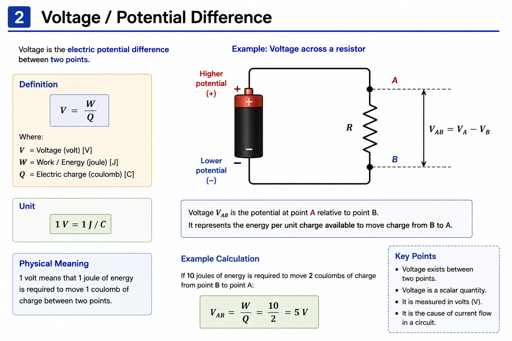

# Voltage, Current and Resistance

## Objective

Understand the physical meaning of voltage, current and resistance
and how these quantities are related in electrical circuits.

---

## 1. Voltage

Voltage is the **electric potential difference between two points**.

It can be expressed as the energy or work required per unit charge:

$$
V = \frac{W}{Q}
$$

Where:

- $V$ = voltage [V]
- $W$ = work / energy [J]
- $Q$ = electric charge [C]

Therefore:

$$
1V = 1J/C
$$

### Physical Meaning

A voltage of **1 V** means that **1 joule of energy is associated with
each coulomb of charge** between two points.

Voltage always exists **between two points**, rather than at a single
point in isolation.

### Voltage Across a Resistor

The voltage across a component can be expressed as the potential
difference between its two terminals:

$$
V_{AB} = V_A - V_B
$$

In the example above, $V_{AB}$ represents the potential at point $A$
relative to point $B$.

If 10 J of energy is required to move 2 C of charge between the two
points:

$$
V_{AB} = \frac{W}{Q}
$$

$$
V_{AB} = \frac{10}{2} = 5V
$$

Therefore:

$$
\boxed{V_{AB}=5V}
$$

---

## 2. Current

Current is the **rate of flow of electric charge**:

$$
I = \frac{dQ}{dt}
$$

For constant current:

$$
I = \frac{Q}{t}
$$

Where:

| Symbol | Meaning | Unit |
|---|---|---|
| $I$ | Current | A |
| $Q$ | Charge | C |
| $t$ | Time | s |

Therefore:

$$
1A = 1C/s
$$

### Physical Meaning

A current of **1 A** means that **1 coulomb of charge passes through
a point every second**.

---

## 3. Resistance

Resistance describes the **opposition to electric current**.

For a uniform conductor:

$$
R = \rho\frac{L}{A}
$$

Where:

| Symbol | Meaning | Unit |
|---|---|---|
| $R$ | Resistance | $\Omega$ |
| $\rho$ | Resistivity | $\Omega m$ |
| $L$ | Conductor length | m |
| $A$ | Cross-sectional area | $m^2$ |

Therefore:

- Increasing conductor length increases resistance.
- Increasing cross-sectional area decreases resistance.
- Different materials have different resistivities.

### Physical Meaning

Resistance determines how strongly a material or component opposes
the flow of current.

This becomes particularly important in power electronics because
resistance causes **power dissipation and voltage drop**.

---

## 4. Voltage–Current–Resistance Relationship

Voltage, current and resistance are closely related in an electrical
circuit.

For an ohmic resistor, these quantities are related by **Ohm's Law**:

$$
V = IR
$$

The following diagram summarizes the relationship between voltage,
current and resistance, including the effect of changing voltage or
resistance on current.

The relationship can also be rearranged as:

$$
I = \frac{V}{R}
$$

and:

$$
R = \frac{V}{I}
$$

### Physical Relationship

For constant resistance:

$$
V \uparrow \Rightarrow I \uparrow
$$

For constant voltage:

$$
R \uparrow \Rightarrow I \downarrow
$$

The detailed mathematical treatment of Ohm's Law is covered in the
next topic.

---

## Key Takeaways

- Voltage is the **potential difference between two points**.
- Voltage is measured in volts (V).
- Current is the **rate of charge flow**.
- Current is measured in amperes (A).
- Resistance opposes current flow.
- Resistance is measured in ohms ($\Omega$).
- Voltage can be expressed as energy per unit charge:

$$
V = \frac{W}{Q}
$$

- Current can be expressed as charge flow per unit time:

$$
I = \frac{dQ}{dt}
$$

- For an ohmic resistor:

$$
V = IR
$$

