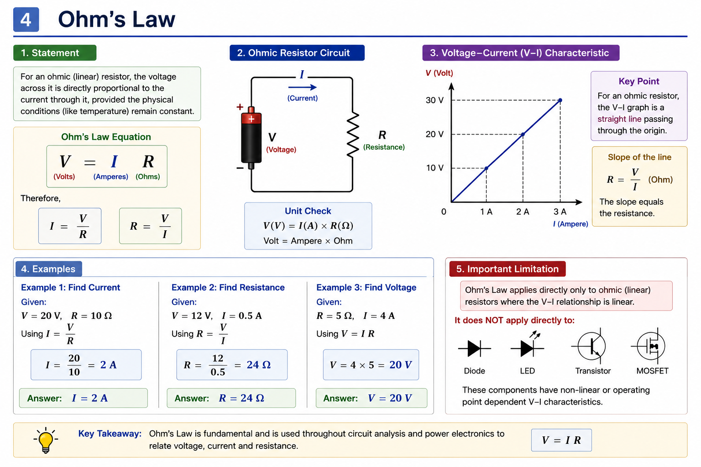

# Ohm's Law

## Objective

Understand and apply the relationship between voltage, current and
resistance in electrical circuits.

---

## 1. Ohm's Law

For an ohmic (linear) resistor, voltage, current and resistance are
related by Ohm's Law:

$$
\boxed{V = IR}
$$

Therefore:

$$
I = \frac{V}{R}
$$

and:

$$
R = \frac{V}{I}
$$

---

## 2. Physical Meaning

For an ohmic resistor, voltage and current are directly proportional
when the resistance remains constant:

$$
V \propto I
$$

Therefore:

- Increasing voltage increases current when $R$ is constant.
- Increasing resistance decreases current when $V$ is constant.
- Decreasing resistance increases current when $V$ is constant.

### Ohm's Law Triangle

The relationship can be remembered as:

$$
V = IR
$$

or:

$$
I = \frac{V}{R}
$$

or:

$$
R = \frac{V}{I}
$$

---

## 3. V–I Characteristic of an Ohmic Resistor

For an ohmic resistor, the voltage-current relationship is linear:

$$
V = IR
$$

If voltage is plotted against current, the graph is a straight line
passing through the origin.

The slope of the $V-I$ characteristic is:

$$
R = \frac{V}{I}
$$

Therefore, the slope of the $V-I$ graph represents the resistance.

---

## 4. Example 1 — Calculate Current

Given:

$$
V = 20V
$$

$$
R = 10\Omega
$$

Using:

$$
I = \frac{V}{R}
$$

Therefore:

$$
I = \frac{20}{10} = 2A
$$

### Result

$$
\boxed{I = 2A}
$$

---

## 5. Example 2 — Calculate Resistance

Given:

$$
V = 12V
$$

$$
I = 0.5A
$$

Using:

$$
R = \frac{V}{I}
$$

Therefore:

$$
R = \frac{12}{0.5} = 24\Omega
$$

### Result

$$
\boxed{R = 24\Omega}
$$

---

## 6. Example 3 — Calculate Voltage

Given:

$$
R = 5\Omega
$$

$$
I = 4A
$$

Using:

$$
V = IR
$$

Therefore:

$$
V = 4 \times 5 = 20V
$$

### Result

$$
\boxed{V = 20V}
$$

---

## 7. Important Limitation

Ohm's Law applies directly to **ohmic (linear) resistors**, where the
voltage-current relationship remains linear under the given physical
conditions.

It does not directly describe the nonlinear $V-I$ behavior of many
electronic components, such as:

- Diodes
- LEDs
- Transistors
- MOSFETs

These components have nonlinear or operating-point-dependent
characteristics.

---

## Key Takeaways

### Fundamental relationship

$$
\boxed{V = IR}
$$

### Rearranged forms

$$
\boxed{I = \frac{V}{R}}
$$

$$
\boxed{R = \frac{V}{I}}
$$

### Important observations

- Voltage and current are proportional for a constant resistance.
- The slope of a $V-I$ graph represents resistance.
- Ohm's Law applies directly to ohmic/linear resistive behavior.
- Not all electronic components are ohmic.

