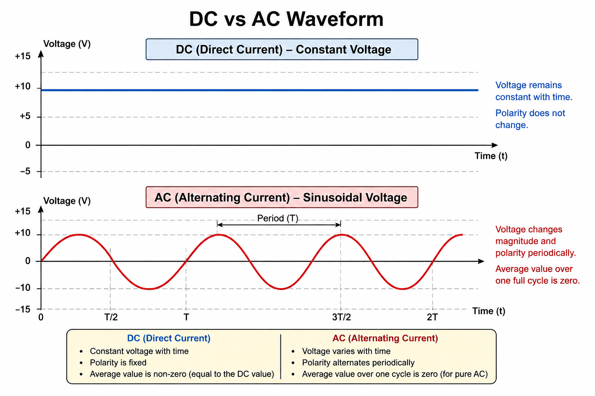
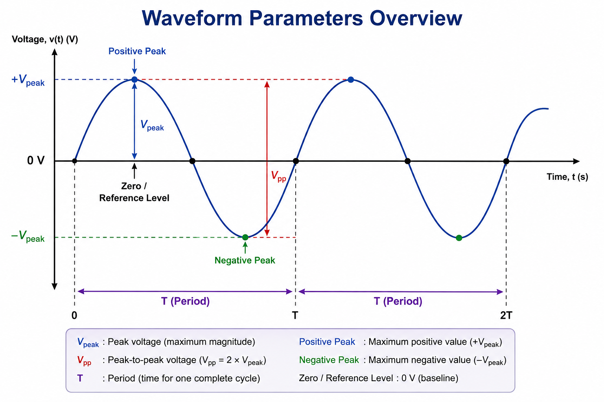
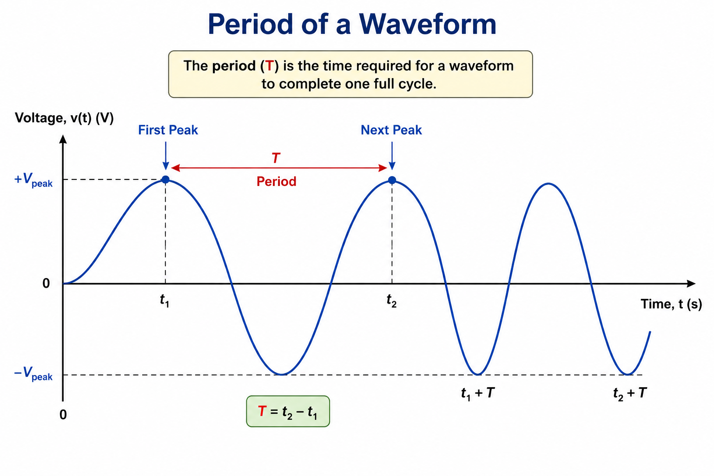
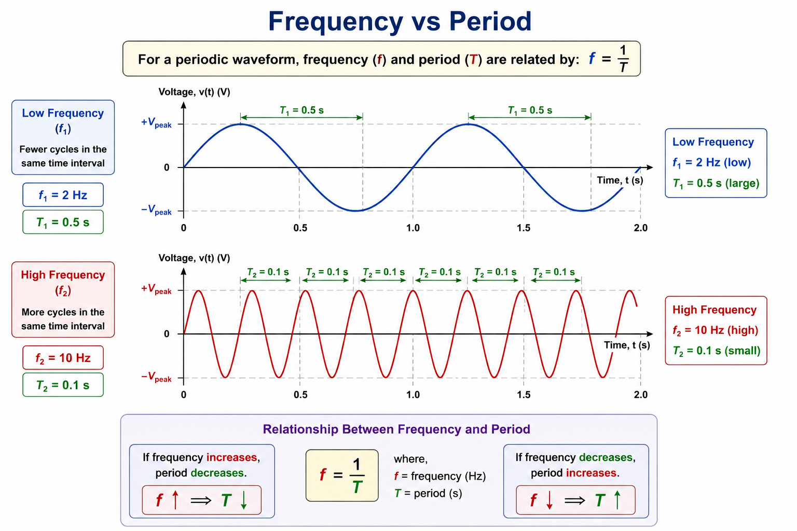
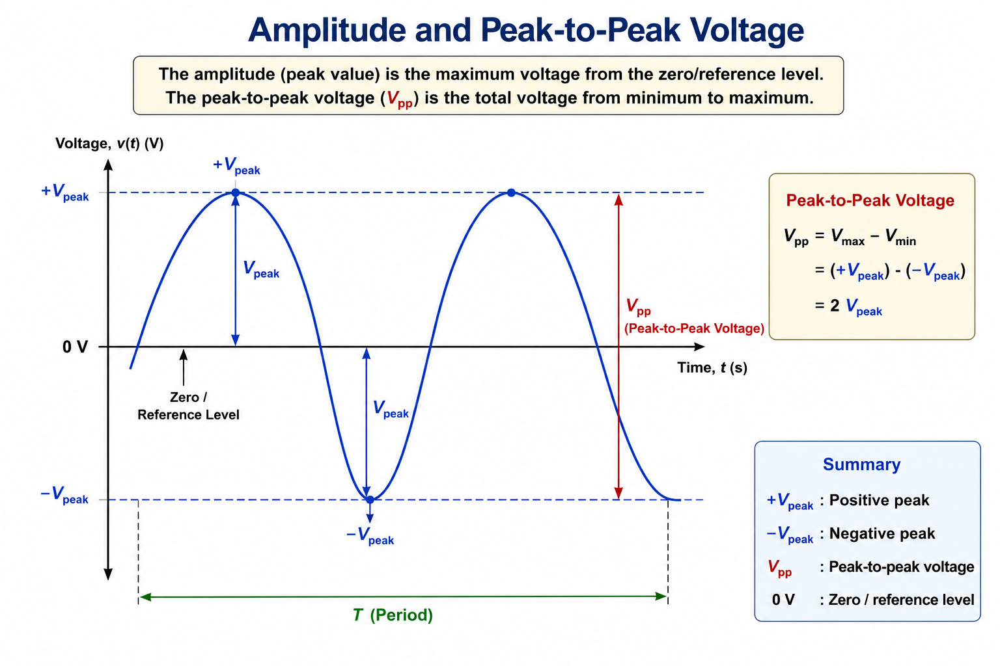
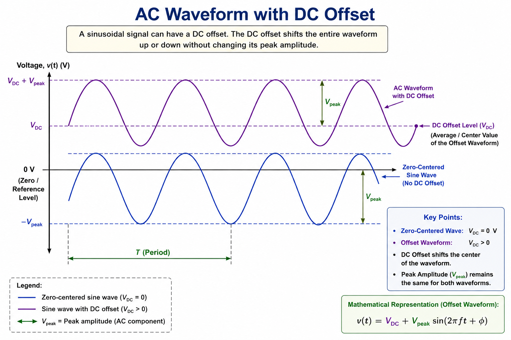
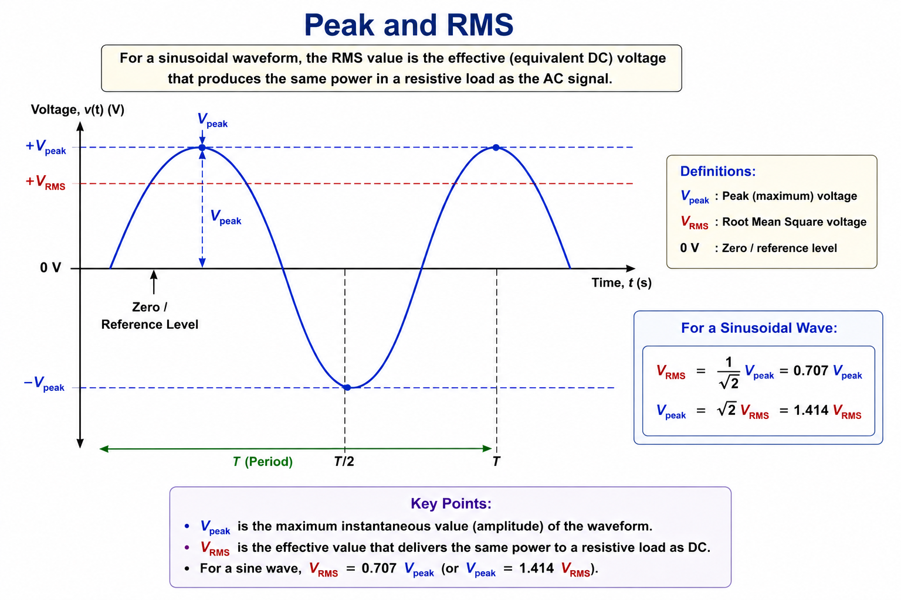
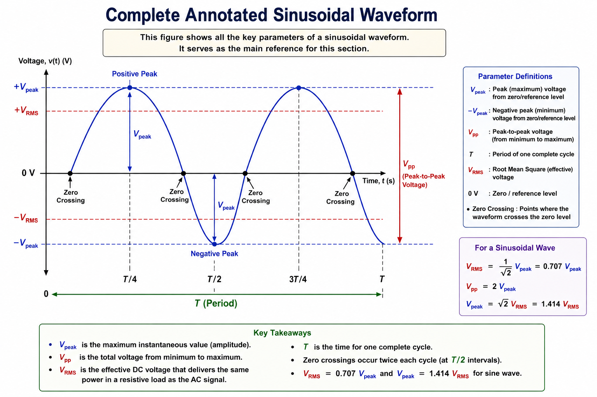
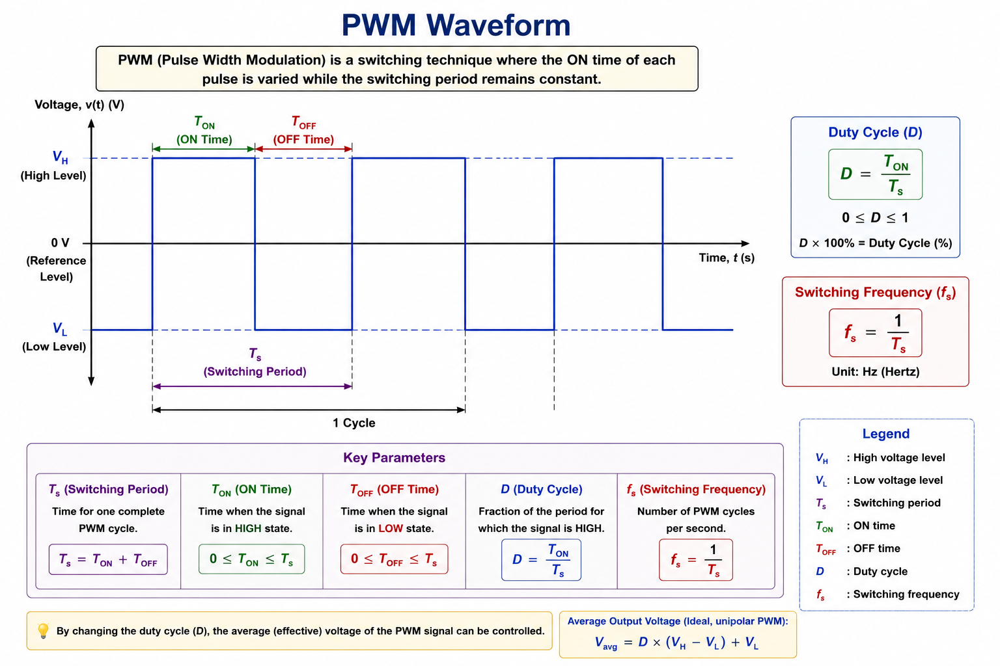

# DC and AC Signals

## Objective

Understand the fundamental differences between DC and AC signals and
learn how electrical waveforms are described using important waveform
parameters such as period, frequency, amplitude, peak-to-peak value,
DC offset and RMS value.

These concepts are essential for understanding electrical circuits,
PWM signals, switching converters, MOSFETs, GaN devices and
power-electronics measurements.

---

# 1. DC vs AC

## 1.1 Direct Current (DC)

Direct current (DC) is an electrical signal whose direction of current
remains constant.

In the simplest case, a DC voltage is constant with time:

$$
V(t)=V_{DC}
$$

For example:

$$
V(t)=12V
$$

The voltage remains at 12 V.

A DC signal does not necessarily have to be perfectly constant. A
time-varying signal can also contain a DC component if its average
value is non-zero.

### Example

A battery can provide approximately:

$$
V_{DC}=12V
$$

The polarity remains fixed:

- Positive terminal remains positive.
- Negative terminal remains negative.
- Conventional current maintains the same direction in a simple
  resistive circuit.

---

## 1.2 Alternating Current (AC)

Alternating current (AC) is an electrical signal that periodically
changes magnitude and direction.

A sinusoidal AC voltage can be represented as:

$$
v(t)=V_{peak}\sin(2\pi ft+\phi)
$$

where:

| Symbol | Meaning | Unit |
| ------ | ------- | ---- |
| $V_{peak}$ | Peak voltage | V |
| $f$ | Frequency | Hz |
| $t$ | Time | s |
| $\phi$ | Phase angle | rad |

For a pure sinusoidal AC signal centered around zero, the average value
over one complete cycle is zero.

  

---

## 1.3 DC and AC Comparison

| Characteristic | DC | AC |
| --- | --- | --- |
| Direction | Constant | Periodically changes |
| Magnitude | Can be constant or varying | Usually time-varying |
| Polarity | Fixed for pure DC | Alternates for sinusoidal AC |
| Example | Battery output | Mains voltage |
| Typical power-electronics use | DC input/output buses | AC input, inverter output |

### Important Distinction

DC and AC describe the behavior of a signal.

A waveform does not have to be perfectly flat to contain a DC
component.

For example, a waveform can be represented as:

$$
v(t)=V_{DC}+v_{AC}(t)
$$

where:

- $V_{DC}$ is the DC component.
- $v_{AC}(t)$ is the time-varying component.

This concept becomes important later when analyzing PWM signals,
converter waveforms and ripple.

---

# 2. Waveform Parameters

After identifying whether a signal is DC or AC, the next step is to
describe the waveform quantitatively.

A periodic waveform can be described using several important
parameters:

| Parameter | Symbol | Meaning | Unit |
| --- | --- | --- | --- |
| Period | $T$ | Time required for one complete cycle | s |
| Frequency | $f$ | Number of cycles per second | Hz |
| Peak amplitude | $V_{peak}$ | Maximum magnitude relative to reference | V |
| Peak-to-peak value | $V_{pp}$ | Difference between maximum and minimum | V |
| DC offset | $V_{DC}$ | Average/center value of the waveform | V |
| RMS value | $V_{RMS}$ | Effective value of the waveform | V |

These parameters allow us to describe and interpret electrical
waveforms measured using an oscilloscope.

  

---

# 3. Period

The **period** is the time required for a periodic waveform to complete
one complete cycle.

It is represented by:

$$
T
$$

and is measured in seconds:

$$
[T]=s
$$

For example, if one complete cycle takes:

$$
T=10\mu s
$$

then the waveform repeats every 10 microseconds.

---

## 3.1 Measuring Period

For a periodic waveform, the period can be measured between two
equivalent points on consecutive cycles.

For example:

- Peak to the next peak
- Rising edge to the next rising edge
- Falling edge to the next falling edge
- Equivalent zero crossings

  

---

# 4. Frequency

Frequency describes how many complete cycles occur every second.

It is represented by:

$$
f
$$

and measured in hertz:

$$
[f]=Hz
$$

Therefore:

$$
1Hz=1\ cycle/s
$$

For example:

$$
f=100Hz
$$

means that the waveform completes 100 cycles every second.

---

## 4.1 Relationship Between Frequency and Period

Frequency and period are reciprocals:

$$
\boxed{f=\frac{1}{T}}
$$

Therefore:

$$
\boxed{T=\frac{1}{f}}
$$

### Example

If:

$$
f=100kHz
$$

then:

$$
T=\frac{1}{100000}
$$

$$
T=10\mu s
$$

Therefore:

$$
\boxed{T=10\mu s}
$$

  

---

# 5. Amplitude

Amplitude describes the magnitude of a waveform relative to a
reference level.

For a sinusoidal waveform centered around zero, the maximum positive
value is the positive peak and the maximum negative value is the
negative peak.

The maximum magnitude is called the **peak amplitude**:

$$
V_{peak}
$$

For example:

$$
V_{peak}=10V
$$

means that the waveform reaches:

$$
+10V
$$

and:

$$
-10V
$$

for a zero-centered sinusoidal waveform.

---

# 6. Peak-to-Peak Voltage

Peak-to-peak voltage is the difference between the maximum and minimum
values of a waveform.

$$
\boxed{V_{pp}=V_{max}-V_{min}}
$$

For a sinusoidal waveform centered around zero:

$$
V_{max}=V_{peak}
$$

and:

$$
V_{min}=-V_{peak}
$$

Therefore:

$$
V_{pp}=V_{peak}-(-V_{peak})
$$

$$
\boxed{V_{pp}=2V_{peak}}
$$

### Example

If:

$$
V_{peak}=5V
$$

then:

$$
V_{pp}=2(5)
$$

$$
\boxed{V_{pp}=10V}
$$

  

---

# 7. DC Offset

A waveform does not necessarily have to be centered around zero.

A sinusoidal signal can have a DC offset:

$$
v(t)=V_{DC}+V_{peak}\sin(2\pi ft+\phi)
$$

where:

- $V_{DC}$ = DC offset
- $V_{peak}$ = AC peak amplitude
- $f$ = frequency
- $\phi$ = phase

For example:

$$
v(t)=5+2\sin(2\pi ft)
$$

The waveform has:

$$
V_{DC}=5V
$$

and:

$$
V_{peak}=2V
$$

Therefore:

$$
V_{max}=7V
$$

and:

$$
V_{min}=3V
$$

The waveform oscillates around 5 V rather than 0 V.

  

---

# 8. RMS Value

RMS stands for **Root Mean Square**.

The RMS value is a way of representing the effective magnitude of a
time-varying signal.

For a periodic voltage waveform:

$$
\boxed{
V_{RMS}
=
\sqrt{
\frac{1}{T}
\int_0^T v^2(t)\,dt
}
}
$$

Similarly, for current:

$$
\boxed{
I_{RMS}
=
\sqrt{
\frac{1}{T}
\int_0^T i^2(t)\,dt
}
}
$$

The RMS value is particularly important because it is related to the
heating effect and average power delivered to a resistive load.

---

# 9. RMS of a DC Signal

For a constant DC voltage:

$$
v(t)=V_{DC}
$$

the RMS value is simply:

$$
\boxed{V_{RMS}=V_{DC}}
$$

For example, if:

$$
V_{DC}=12V
$$

then:

$$
\boxed{V_{RMS}=12V}
$$

---

# 10. RMS of a Sinusoidal Signal

For a sinusoidal voltage:

$$
v(t)=V_{peak}\sin(\omega t)
$$

the RMS value is:

$$
\boxed{
V_{RMS}=\frac{V_{peak}}{\sqrt{2}}
}
$$

Similarly:

$$
\boxed{
I_{RMS}=\frac{I_{peak}}{\sqrt{2}}
}
$$

---

## 10.1 Derivation of Sinusoidal RMS

The RMS definition is:

$$
V_{RMS}
=
\sqrt{
\frac{1}{T}
\int_0^T v^2(t)\,dt
}
$$

For:

$$
v(t)=V_{peak}\sin(\omega t)
$$

substitute into the RMS equation:

$$
V_{RMS}
=
\sqrt{
\frac{1}{T}
\int_0^T
V_{peak}^2\sin^2(\omega t)\,dt
}
$$

Since $V_{peak}$ is constant:

$$
V_{RMS}
=
V_{peak}
\sqrt{
\frac{1}{T}
\int_0^T
\sin^2(\omega t)\,dt
}
$$

The average value of $\sin^2(\omega t)$ over one complete cycle is:

$$
\frac{1}{2}
$$

Therefore:

$$
V_{RMS}
=
V_{peak}\sqrt{\frac{1}{2}}
$$

Thus:

$$
\boxed{
V_{RMS}=\frac{V_{peak}}{\sqrt{2}}
}
$$

---

## 10.2 RMS Example

Suppose:

$$
V_{peak}=100V
$$

Then:

$$
V_{RMS}
=
\frac{100}{\sqrt{2}}
$$

$$
\boxed{V_{RMS}\approx70.7V}
$$

  

---

# 11. Why RMS Matters

RMS is useful because it allows a time-varying voltage or current to
be compared with an equivalent DC quantity for resistive heating.

For a resistor:

$$
P_{avg}=V_{RMS}I_{RMS}
$$

For a purely resistive load:

$$
\boxed{
P_{avg}=I_{RMS}^2R
}
$$

or:

$$
\boxed{
P_{avg}=\frac{V_{RMS}^2}{R}
}
$$

Therefore, RMS values are important when calculating electrical power
and losses.

---

# 12. Putting Waveform Parameters Together

A periodic waveform can therefore be described using:

| Parameter | Symbol | Meaning | Unit |
| --- | --- | --- | --- |
| DC level | $V_{DC}$ | Average/offset level | V |
| Peak value | $V_{peak}$ | Maximum magnitude | V |
| Peak-to-peak | $V_{pp}$ | Maximum-to-minimum range | V |
| RMS value | $V_{RMS}$ | Effective value | V |
| Period | $T$ | Time for one cycle | s |
| Frequency | $f$ | Cycles per second | Hz |
| Phase | $\phi$ | Relative timing/shift | rad |

For a zero-offset sinusoidal waveform:

$$
V_{pp}=2V_{peak}
$$

and:

$$
V_{RMS}=\frac{V_{peak}}{\sqrt{2}}
$$

and:

$$
f=\frac{1}{T}
$$

  

---

# 13. Power Electronics Connection

These waveform concepts are directly used when analyzing power
converters.

## 13.1 Switching Frequency

A buck or boost converter operates at a switching frequency:

$$
f_s
$$

The corresponding switching period is:

$$
\boxed{T_s=\frac{1}{f_s}}
$$

For example:

$$
f_s=100kHz
$$

gives:

$$
T_s=\frac{1}{100000}
$$

$$
\boxed{T_s=10\mu s}
$$

The MOSFET switching events therefore repeat every 10 microseconds.

---

## 13.2 PWM Signal

A MOSFET in a switching converter is typically controlled using a
PWM signal.

The PWM signal switches between voltage levels.

Important parameters include:

- Switching frequency
- Switching period
- Duty cycle
- ON time
- OFF time
- Rise time
- Fall time

The duty cycle is:

$$
\boxed{
D=\frac{T_{ON}}{T_s}
}
$$

where:

- $T_{ON}$ = ON time
- $T_s$ = switching period

For example, for:

$$
f_s=100kHz
$$

and:

$$
D=50\%
$$

the switching period is:

$$
T_s=10\mu s
$$

and:

$$
T_{ON}=5\mu s
$$

  

---

# 14. Measurement Example

When using an oscilloscope to measure a power-electronics waveform,
you may encounter:

- $V_{DS}$
- $V_{GS}$
- $V_{OUT}$
- $I_L$

For example, if a switching waveform repeats every:

$$
T_s=10\mu s
$$

then:

$$
f_s=\frac{1}{10\mu s}
$$

Therefore:

$$
\boxed{f_s=100kHz}
$$

This is the same relationship used when analyzing the switching
frequency of a buck or boost converter.

---

# 15. Worked Example — Reading a Waveform

Suppose an oscilloscope shows a sinusoidal voltage with:

$$
V_{max}=+10V
$$

and:

$$
V_{min}=-10V
$$

The time between two consecutive peaks is:

$$
T=20\mu s
$$

### Step 1 — Peak Voltage

$$
V_{peak}=10V
$$

### Step 2 — Peak-to-Peak Voltage

$$
V_{pp}=V_{max}-V_{min}
$$

$$
V_{pp}=10-(-10)
$$

$$
\boxed{V_{pp}=20V}
$$

### Step 3 — Frequency

$$
f=\frac{1}{T}
$$

$$
f=\frac{1}{20\mu s}
$$

$$
\boxed{f=50kHz}
$$

### Step 4 — RMS Voltage

$$
V_{RMS}=\frac{V_{peak}}{\sqrt{2}}
$$

$$
V_{RMS}=\frac{10}{\sqrt{2}}
$$

$$
\boxed{V_{RMS}\approx7.07V}
$$

---

# 18. Key Takeaways

- DC and AC describe the behavior of electrical signals.
- A pure DC voltage remains constant with time.
- AC periodically changes magnitude and direction.
- Waveforms can be described using parameters such as period,
  frequency, amplitude, peak-to-peak value, DC offset and RMS.
- Frequency describes the number of cycles per second.
- Period describes the time required for one cycle.
- Frequency and period are reciprocals:

$$
f=\frac{1}{T}
$$

- Peak-to-peak voltage is the difference between maximum and minimum
  voltage.
- For a zero-centered sine wave:

$$
V_{pp}=2V_{peak}
$$

- RMS represents the effective value of a time-varying signal.
- For a sinusoidal waveform:

$$
V_{RMS}=\frac{V_{peak}}{\sqrt{2}}
$$

- Switching frequency and period are fundamental parameters in
  power electronics.
- These concepts are directly used when analyzing MOSFET, GaN,
  buck-converter and boost-converter waveforms.