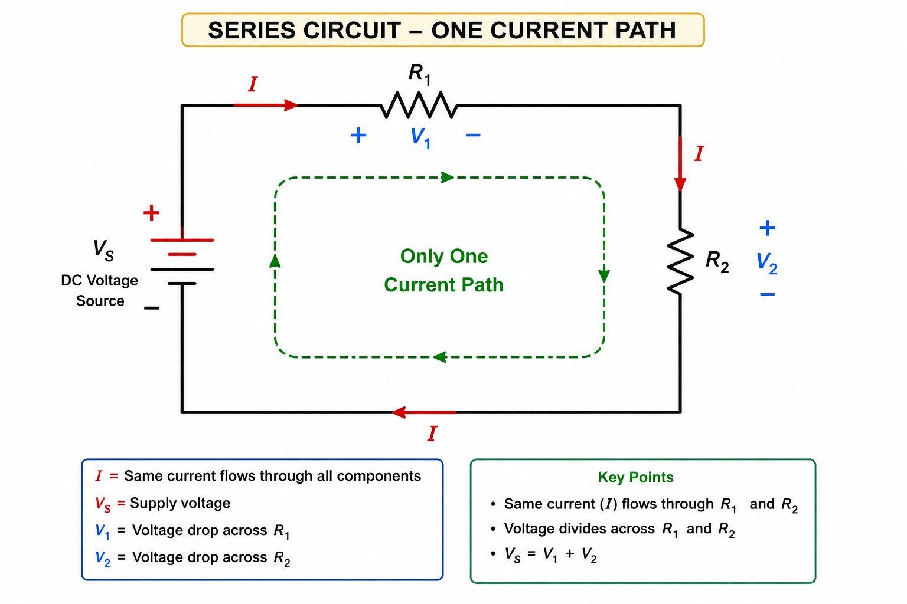
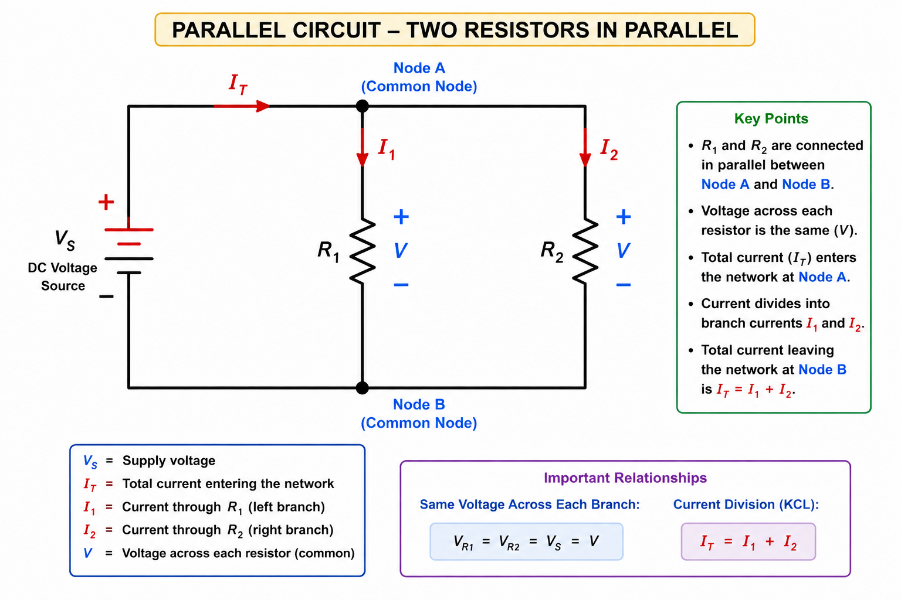
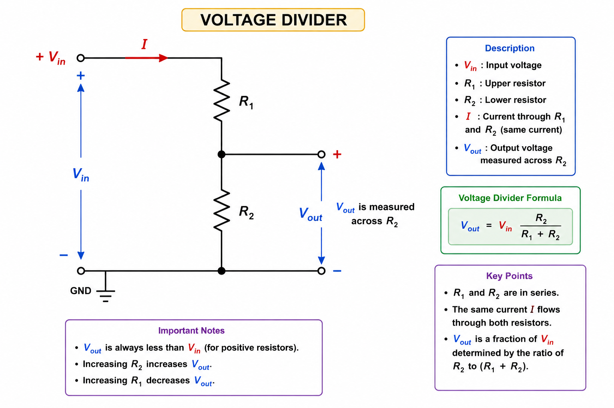
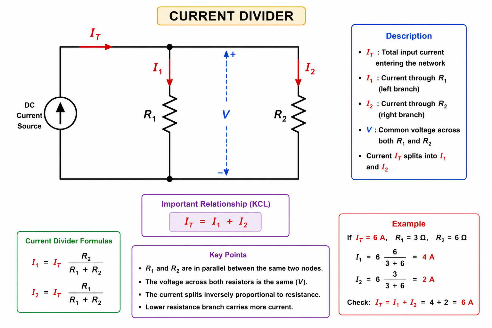

# Basic Circuits

## Objective

Understand the behavior of resistors connected in series and parallel,
and learn how voltage and current are distributed in basic resistor
networks.

These concepts form the foundation for analyzing electrical circuits,
voltage-divider circuits, current-divider circuits, and more complex
circuit networks.

---

# 1. Series Circuits

## 1.1 What is a Series Circuit?

A series circuit is a circuit in which components are connected
one after another along a single current path.

For example, two resistors connected in series form:

$$
R_1 \rightarrow R_2
$$

Because there is only one path for current, the same current flows
through every component in the series path.

  

---

## 1.2 Current in a Series Circuit

In a series circuit, there is only one path for current.

Therefore, the same current flows through every component:

$$
\boxed{
I_T=I_1=I_2=I_3
}
$$

For example, if:

$$
I_T=2A
$$

then:

$$
I_1=I_2=I_3=2A
$$

### Key Point

> **Current is the same through all components connected in series.**

---

## 1.3 Voltage in a Series Circuit

The total supply voltage is distributed across the individual
components.

Using Kirchhoff's Voltage Law:

$$
V_T=V_1+V_2+V_3+\cdots
$$

For two resistors:

$$
\boxed{
V_T=V_1+V_2
}
$$

Therefore, the voltage across each resistor is only a portion of the
total supply voltage.

### Example

Suppose:

$$
V_T=12V
$$

and:

$$
V_1=5V
$$

Then:

$$
V_2=V_T-V_1
$$

$$
V_2=12-5
$$

$$
\boxed{V_2=7V}
$$

---

## 1.4 Equivalent Resistance of Series Resistors

For resistors connected in series, the equivalent resistance is the
sum of the individual resistances:

$$
\boxed{
R_T=R_1+R_2+\cdots+R_n
}
$$

For two resistors:

$$
R_T=R_1+R_2
$$

### Example

If:

$$
R_1=10\Omega
$$

and:

$$
R_2=20\Omega
$$

then:

$$
R_T=10+20
$$

$$
\boxed{R_T=30\Omega}
$$

The series combination behaves like a single $30\Omega$ resistor.

---

## 1.5 Series Circuit Example

Consider:

$$
V_T=12V
$$

with:

$$
R_1=4\Omega
$$

and:

$$
R_2=8\Omega
$$

### Step 1 — Calculate Equivalent Resistance

$$
R_T=R_1+R_2
$$

$$
R_T=4+8
$$

$$
R_T=12\Omega
$$

### Step 2 — Calculate Circuit Current

Using Ohm's Law:

$$
I_T=\frac{V_T}{R_T}
$$

$$
I_T=\frac{12}{12}
$$

$$
\boxed{I_T=1A}
$$

Because the resistors are in series:

$$
\boxed{I_1=I_2=1A}
$$

### Step 3 — Calculate Voltage Across Each Resistor

For $R_1$:

$$
V_1=I_1R_1
$$

$$
V_1=1\times4
$$

$$
\boxed{V_1=4V}
$$

For $R_2$:

$$
V_2=I_2R_2
$$

$$
V_2=1\times8
$$

$$
\boxed{V_2=8V}
$$

Check:

$$
V_1+V_2=4+8=12V
$$

Therefore:

$$
\boxed{V_T=V_1+V_2}
$$

---

# 2. Parallel Circuits

## 2.1 What is a Parallel Circuit?

A parallel circuit is a circuit in which components are connected
between the same two electrical nodes.

This creates multiple paths through which current can flow.

  

---

## 2.2 Voltage in a Parallel Circuit

In a parallel circuit, every branch is connected across the same two
nodes.

Therefore, the voltage across each branch is the same:

$$
\boxed{
V_T=V_1=V_2=V_3
}
$$

For example, if the supply voltage is:

$$
V_T=12V
$$

then:

$$
V_1=V_2=V_3=12V
$$

### Key Point

> **Voltage is the same across all components connected in parallel.**

---

## 2.3 Current in a Parallel Circuit

The total current entering a parallel network is divided among the
different branches.

Using Kirchhoff's Current Law:

$$
\boxed{
I_T=I_1+I_2+I_3+\cdots
}
$$

For two branches:

$$
\boxed{
I_T=I_1+I_2
}
$$

The amount of current flowing through each branch depends on its
resistance.

A lower resistance branch carries more current.

---

## 2.4 Equivalent Resistance of Parallel Resistors

For resistors connected in parallel:

$$
\boxed{
\frac{1}{R_T}
=
\frac{1}{R_1}
+
\frac{1}{R_2}
+\cdots+
\frac{1}{R_n}
}
$$

For two resistors:

$$
\frac{1}{R_T}
=
\frac{1}{R_1}
+
\frac{1}{R_2}
$$

For two parallel resistors, this can also be written as:

$$
\boxed{
R_T=
\frac{R_1R_2}{R_1+R_2}
}
$$

### Important Property

For two or more positive resistors in parallel:

$$
R_T < R_1
$$

and:

$$
R_T < R_2
$$

Therefore, the equivalent resistance of a parallel network is always
less than the smallest individual resistance.

---

## 2.5 Parallel Circuit Example

Consider:

$$
V_T=12V
$$

with:

$$
R_1=6\Omega
$$

and:

$$
R_2=3\Omega
$$

### Step 1 — Calculate Branch Currents

Because the resistors are in parallel:

$$
V_1=V_2=12V
$$

For $R_1$:

$$
I_1=\frac{V_1}{R_1}
$$

$$
I_1=\frac{12}{6}
$$

$$
\boxed{I_1=2A}
$$

For $R_2$:

$$
I_2=\frac{V_2}{R_2}
$$

$$
I_2=\frac{12}{3}
$$

$$
\boxed{I_2=4A}
$$

### Step 2 — Calculate Total Current

$$
I_T=I_1+I_2
$$

$$
I_T=2+4
$$

$$
\boxed{I_T=6A}
$$

### Step 3 — Calculate Equivalent Resistance

Using:

$$
R_T=\frac{V_T}{I_T}
$$

$$
R_T=\frac{12}{6}
$$

$$
\boxed{R_T=2\Omega}
$$

Notice that:

$$
2\Omega < 3\Omega < 6\Omega
$$

which confirms the important property of parallel resistors.

---

# 3. Voltage Divider

## 3.1 Voltage Divider Concept

A voltage divider is a simple circuit used to obtain a fraction of an
input voltage.

The basic voltage-divider circuit consists of two resistors connected
in series.

  

---

## 3.2 Voltage Divider Derivation

Consider two resistors connected in series:

$$
R_1
$$

and:

$$
R_2
$$

The total resistance is:

$$
R_T=R_1+R_2
$$

The current through the circuit is:

$$
I=\frac{V_{in}}{R_1+R_2}
$$

The output voltage is measured across $R_2$:

$$
V_{out}=IR_2
$$

Substituting the current:

$$
V_{out}
=
\frac{V_{in}}{R_1+R_2}R_2
$$

Therefore:

$$
\boxed{
V_{out}
=
V_{in}
\frac{R_2}{R_1+R_2}
}
$$

---

## 3.3 Understanding the Voltage Divider

The output voltage depends on the ratio between the two resistors.

$$
V_{out}
=
V_{in}
\frac{R_2}{R_1+R_2}
$$

Therefore:

- Increasing $R_2$ increases $V_{out}$.
- Increasing $R_1$ decreases $V_{out}$.
- $V_{out}$ is always less than $V_{in}$ for positive resistors.

### Special Case

If:

$$
R_1=R_2
$$

then:

$$
V_{out}
=
V_{in}
\frac{R_2}{R_1+R_2}
$$

Since:

$$
R_1=R_2
$$

we obtain:

$$
V_{out}
=
V_{in}
\frac{1}{2}
$$

Therefore:

$$
\boxed{
V_{out}=\frac{V_{in}}{2}
}
$$

---

## 3.4 Voltage Divider Example

Suppose:

$$
V_{in}=12V
$$

$$
R_1=2k\Omega
$$

and:

$$
R_2=1k\Omega
$$

Using:

$$
V_{out}
=
V_{in}
\frac{R_2}{R_1+R_2}
$$

we obtain:

$$
V_{out}
=
12
\frac{1}{2+1}
$$

$$
V_{out}=4V
$$

Therefore:

$$
\boxed{V_{out}=4V}
$$

---

## 3.5 Voltage Divider with a Load

The basic voltage-divider equation assumes that the output is not
significantly loaded.

If a load resistor $R_L$ is connected to the output, then $R_L$ is
in parallel with $R_2$.

The effective lower resistance becomes:

$$
R_{2,eff}=R_2\parallel R_L
$$

where:

$$
R_2\parallel R_L
=
\frac{R_2R_L}{R_2+R_L}
$$

The loaded voltage divider becomes:

$$
\boxed{
V_{out}
=
V_{in}
\frac{R_2\parallel R_L}
{R_1+(R_2\parallel R_L)}
}
$$

This is important in practical circuits because connecting a load can
change the output voltage.

---

# 4. Current Divider

## 4.1 Current Divider Concept

A current divider is a circuit in which current entering a parallel
network divides between multiple branches.

The basic current-divider circuit consists of two resistors connected
in parallel.

  

---

## 4.2 Current Divider Derivation

Consider two resistors connected in parallel:

$$
R_1
$$

and:

$$
R_2
$$

The total current is:

$$
I_T
$$

According to Kirchhoff's Current Law:

$$
I_T=I_1+I_2
$$

Because the resistors are in parallel, they have the same voltage:

$$
V=I_1R_1=I_2R_2
$$

The equivalent resistance is:

$$
R_T=
\frac{R_1R_2}{R_1+R_2}
$$

Therefore:

$$
V=I_TR_T
$$

Substituting the parallel resistance:

$$
V=
I_T
\frac{R_1R_2}{R_1+R_2}
$$

For branch $R_1$:

$$
I_1=\frac{V}{R_1}
$$

Therefore:

$$
I_1
=
I_T
\frac{R_2}{R_1+R_2}
$$

Thus:

$$
\boxed{
I_1
=
I_T
\frac{R_2}{R_1+R_2}
}
$$

Similarly:

$$
\boxed{
I_2
=
I_T
\frac{R_1}{R_1+R_2}
}
$$

---

## 4.3 Understanding the Current Divider

The current divider has an important property:

> **The branch with lower resistance receives more current.**

For example, if:

$$
R_1<R_2
$$

then:

$$
I_1>I_2
$$

This is because the lower-resistance branch carries a larger portion
of the total current.

---

## 4.4 Current Divider Example

Suppose:

$$
I_T=6A
$$

and:

$$
R_1=3\Omega
$$

$$
R_2=6\Omega
$$

### Current Through $R_1$

$$
I_1
=
I_T
\frac{R_2}{R_1+R_2}
$$

$$
I_1
=
6
\frac{6}{3+6}
$$

$$
I_1
=
6
\frac{6}{9}
$$

$$
\boxed{I_1=4A}
$$

### Current Through $R_2$

$$
I_2
=
I_T
\frac{R_1}{R_1+R_2}
$$

$$
I_2
=
6
\frac{3}{3+6}
$$

$$
I_2
=
6
\frac{3}{9}
$$

$$
\boxed{I_2=2A}
$$

### Check

Using KCL:

$$
I_T=I_1+I_2
$$

$$
I_T=4+2
$$

$$
\boxed{I_T=6A}
$$

The result is consistent.

---
# Key Takeaways

- A series circuit has a single current path.
- A parallel circuit has multiple current paths.
- Current is the same through components connected in series.
- Voltage is the same across components connected in parallel.
- Voltage divides across series components.
- Current divides between parallel branches.
- Series resistance is the sum of individual resistances.
- Parallel resistance is always less than the smallest individual
  resistance.
- A voltage divider uses series resistors to produce a fraction of an
  input voltage.
- A current divider uses parallel resistors to distribute current.
- The voltage-divider equation is:

$$
V_{out}
=
V_{in}
\frac{R_2}{R_1+R_2}
$$

- The current-divider equation for two resistors is:

$$
I_1
=
I_T
\frac{R_2}{R_1+R_2}
$$

- These concepts are fundamental for understanding larger electrical
  circuits and power-electronics systems.