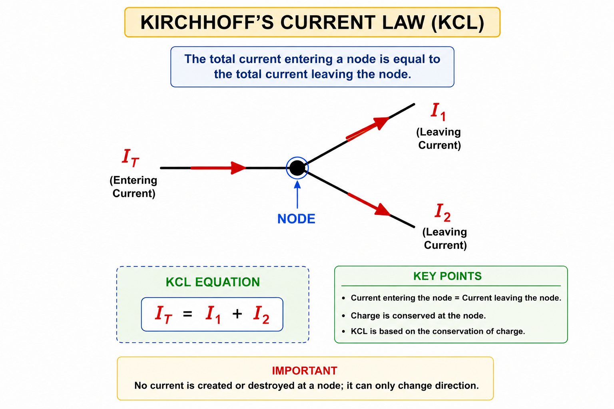
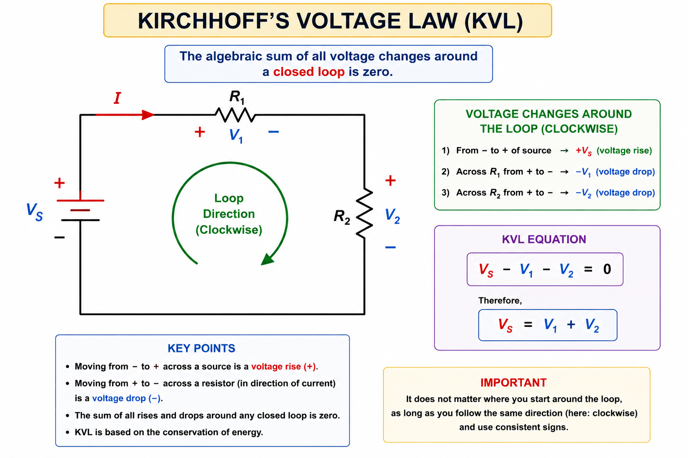
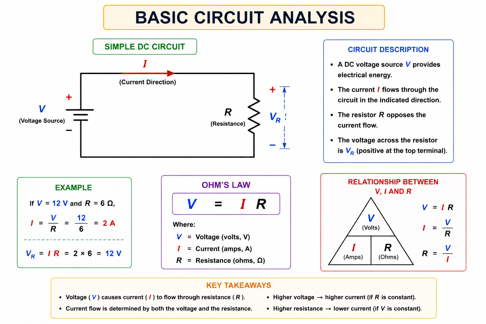
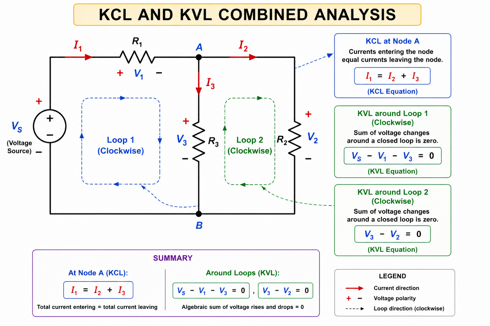
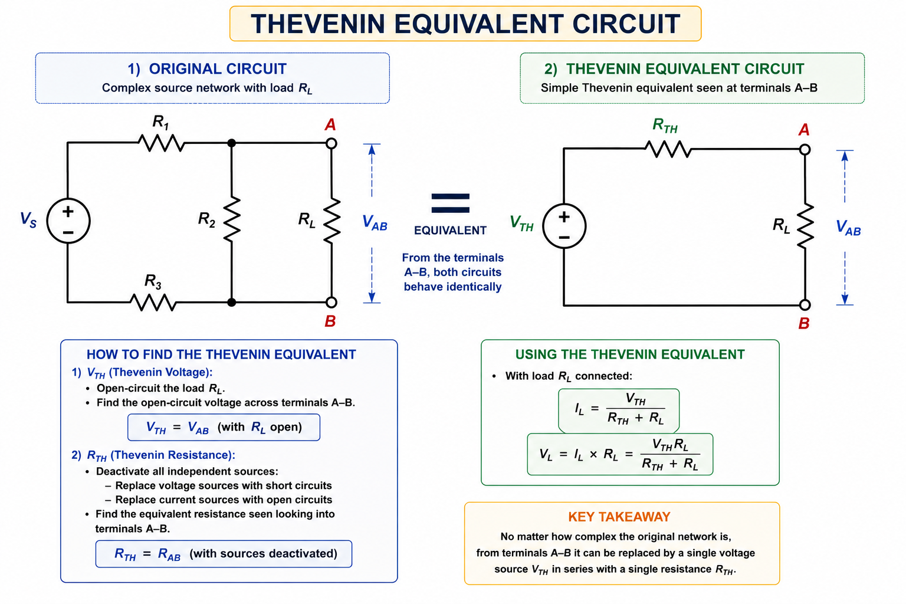
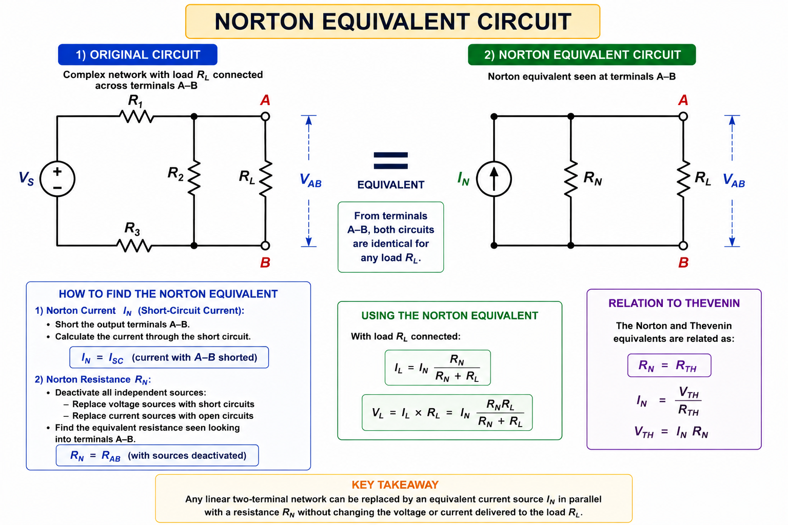
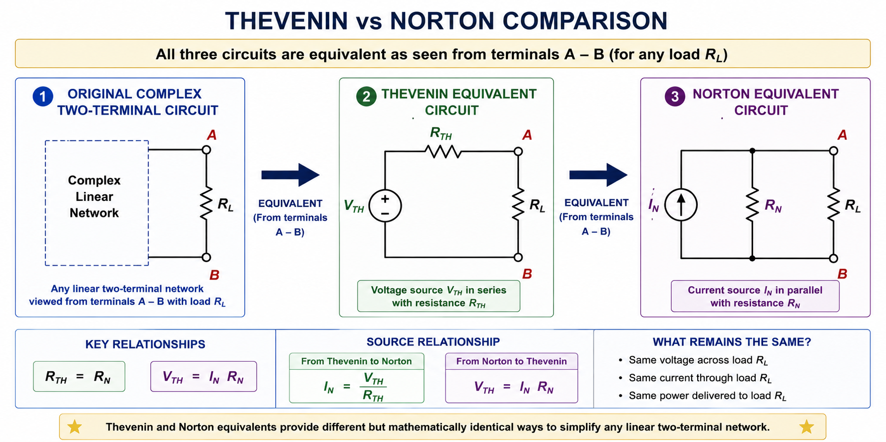
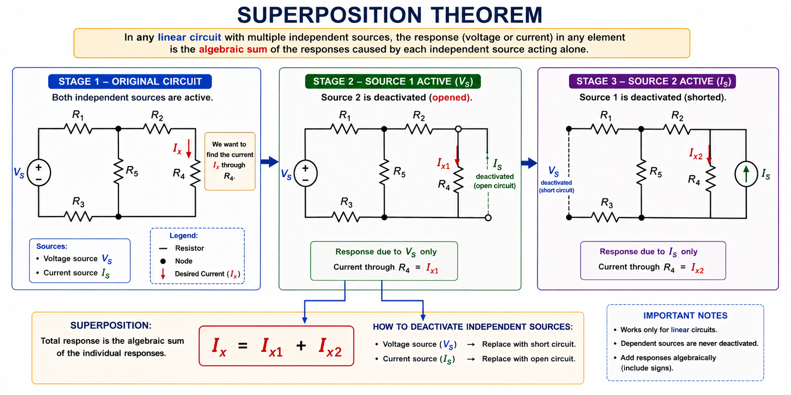
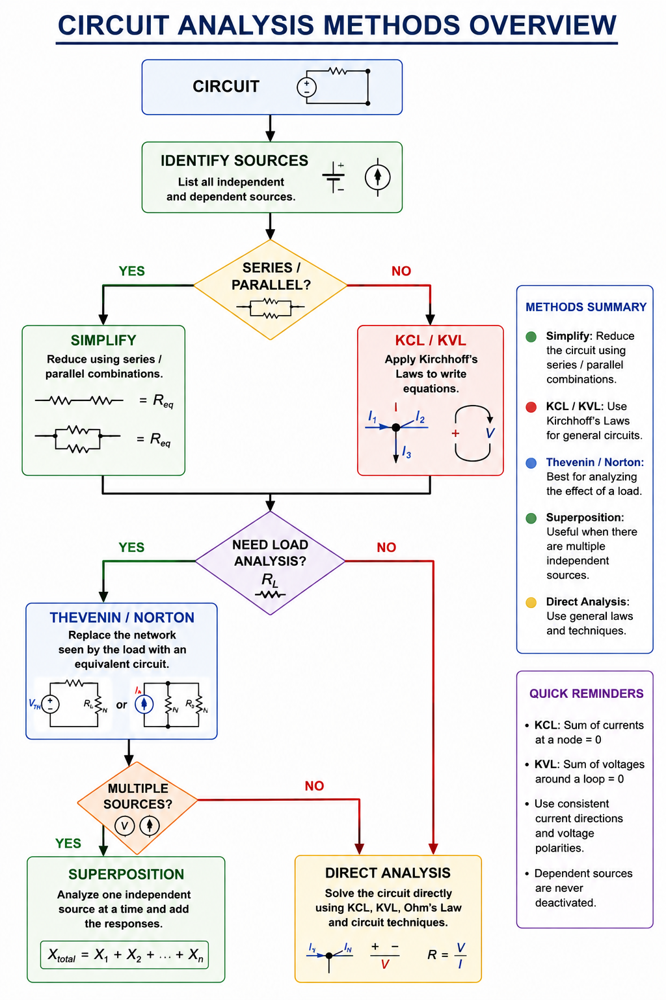

# Circuit Analysis

## Objective

Understand the fundamental methods used to analyze electrical circuits
and determine unknown voltages, currents, and equivalent circuits.

This section introduces:

- Kirchhoff's Current Law (KCL)
- Kirchhoff's Voltage Law (KVL)
- Basic Circuit Analysis
- Thevenin's Theorem
- Norton's Theorem
- Superposition Theorem

These techniques form the foundation for analyzing more complex
electrical and power-electronic circuits.

---

# 1. Kirchhoff's Current Law (KCL)

## 1.1 What is KCL?

Kirchhoff's Current Law is based on the conservation of electric charge.

It states that:

> **The total current entering a node must equal the total current
> leaving the node.**

Mathematically:

$$
\boxed{
\sum I_{in}=\sum I_{out}
}
$$

For a simple node with one incoming current and two outgoing currents:

$$
I_T=I_1+I_2
$$

  

---

## 1.2 KCL Example

Suppose a current of:

$$
I_T=10A
$$

enters a node.

Two currents leave the node:

$$
I_1=4A
$$

and:

$$
I_2=?
$$

Using KCL:

$$
I_T=I_1+I_2
$$

Therefore:

$$
I_2=I_T-I_1
$$

$$
I_2=10-4
$$

$$
\boxed{I_2=6A}
$$

Check:

$$
10A=4A+6A
$$

Therefore, KCL is satisfied.

---

## 1.3 KCL Sign Convention

KCL can also be written using algebraic signs.

For example:

- Currents entering a node → positive.
- Currents leaving a node → negative.

Then:

$$
\boxed{
\sum I=0
}
$$

For example:

$$
I_T-I_1-I_2=0
$$

Rearranging:

$$
I_T=I_1+I_2
$$

Both forms represent the same physical law.

---

# 2. Kirchhoff's Voltage Law (KVL)

## 2.1 What is KVL?

Kirchhoff's Voltage Law is based on the conservation of energy.

It states that:

> **The algebraic sum of all voltage changes around a closed loop is
> zero.**

Mathematically:

$$
\boxed{
\sum V=0
}
$$

For a simple circuit containing a voltage source and two voltage drops:

$$
V_S-V_1-V_2=0
$$

Therefore:

$$
\boxed{
V_S=V_1+V_2
}
$$

  

---

## 2.2 KVL Example

Consider a circuit with:

$$
V_S=12V
$$

and voltage drops:

$$
V_1=5V
$$

$$
V_2=?
$$

Using KVL:

$$
V_S=V_1+V_2
$$

Therefore:

$$
V_2=V_S-V_1
$$

$$
V_2=12-5
$$

$$
\boxed{V_2=7V}
$$

Check:

$$
12V-5V-7V=0
$$

Therefore, KVL is satisfied.

---

## 2.3 KVL Sign Convention

When applying KVL, voltage rises and voltage drops must be assigned
consistent signs.

For example:

$$
+V_S-V_1-V_2=0
$$

A voltage source may represent a voltage rise when traversed from
negative to positive.

A resistor may represent a voltage drop when traversed in the
direction of current.

The important point is to choose a direction and maintain the same
sign convention throughout the analysis.

---

# 3. Basic Circuit Analysis

## 3.1 Circuit Analysis Procedure

Basic circuit analysis involves determining unknown circuit quantities
such as:

- Current
- Voltage
- Resistance
- Power

A useful general procedure is:

1. Identify the known quantities.
2. Identify the unknown quantities.
3. Simplify series and parallel resistor networks where possible.
4. Apply Ohm's Law.
5. Apply KCL or KVL when necessary.
6. Calculate the required quantities.
7. Check the result using KCL, KVL, or power relationships.

---

## 3.2 Ohm's Law

The fundamental relationship between voltage, current, and resistance
is:

$$
\boxed{
V=IR
}
$$

The equation can also be rearranged as:

$$
\boxed{
I=\frac{V}{R}
}
$$

and:

$$
\boxed{
R=\frac{V}{I}
}
$$

  

---

## 3.3 Series and Parallel Simplification

Before applying KCL or KVL, a circuit can often be simplified.

For resistors in series:

$$
\boxed{
R_T=R_1+R_2+\cdots+R_n
}
$$

For two resistors in parallel:

$$
\boxed{
R_T=
\frac{R_1R_2}{R_1+R_2}
}
$$

Simplifying a circuit reduces the number of unknowns and makes the
analysis easier.

---

## 3.4 Basic Circuit Analysis Example

Consider:

$$
V_S=12V
$$

with:

$$
R_1=4\Omega
$$

and:

$$
R_2=8\Omega
$$

connected in series.

### Step 1 — Equivalent Resistance

$$
R_T=R_1+R_2
$$

$$
R_T=4+8
$$

$$
\boxed{R_T=12\Omega}
$$

### Step 2 — Circuit Current

Using Ohm's Law:

$$
I=\frac{V_S}{R_T}
$$

$$
I=\frac{12}{12}
$$

$$
\boxed{I=1A}
$$

### Step 3 — Voltage Across Each Resistor

For $R_1$:

$$
V_1=IR_1
$$

$$
V_1=1\times4
$$

$$
\boxed{V_1=4V}
$$

For $R_2$:

$$
V_2=IR_2
$$

$$
V_2=1\times8
$$

$$
\boxed{V_2=8V}
$$

### Step 4 — Verify Using KVL

$$
V_S-V_1-V_2=0
$$

$$
12-4-8=0
$$

Therefore, the solution satisfies KVL.

---

# 4. Circuit Analysis Using KCL and KVL

KCL and KVL can be used together to solve circuits that cannot be
simplified directly using series and parallel combinations.

  

---

# 5. Thevenin's Theorem

## 5.1 What is Thevenin's Theorem?

Thevenin's Theorem states that any **linear two-terminal circuit** can
be replaced by an equivalent circuit consisting of:

- One voltage source $V_{TH}$.
- One series resistance $R_{TH}$.

The complex original circuit is therefore replaced by a much simpler
equivalent circuit.

  

---

## 5.2 Thevenin Voltage

The Thevenin voltage is the **open-circuit voltage** measured across
the output terminals.

Therefore:

$$
\boxed{
V_{TH}=V_{OC}
}
$$

where:

- $V_{TH}$ = Thevenin voltage.
- $V_{OC}$ = open-circuit voltage.

To find $V_{TH}$:

1. Remove the load $R_L$.
2. Leave the output terminals open.
3. Calculate the voltage across the terminals.

---

## 5.3 Thevenin Resistance

The Thevenin resistance is the equivalent resistance seen looking
into the circuit from the output terminals.

For an independent-source circuit:

1. Remove the load.
2. Deactivate all independent sources.
3. Replace independent voltage sources with short circuits.
4. Replace independent current sources with open circuits.
5. Calculate the resistance seen from the output terminals.

Therefore:

$$
\boxed{
R_{TH}=R_{seen}
}
$$

---

## 5.4 Thevenin Equivalent Circuit

The final Thevenin equivalent is:

$$
\boxed{
\text{Original Circuit}
\rightarrow
V_{TH}+R_{TH}
}
$$

The load can then be reconnected:

$$
V_{TH}
\rightarrow
R_{TH}
\rightarrow
R_L
$$

The load current is:

$$
\boxed{
I_L=
\frac{V_{TH}}{R_{TH}+R_L}
}
$$

The load voltage is:

$$
\boxed{
V_L=I_LR_L
}
$$

---

## 5.5 Thevenin Example

Suppose:

$$
V_{TH}=12V
$$

and:

$$
R_{TH}=2\Omega
$$

with:

$$
R_L=4\Omega
$$

The load current is:

$$
I_L=
\frac{V_{TH}}{R_{TH}+R_L}
$$

$$
I_L=
\frac{12}{2+4}
$$

$$
I_L=
\frac{12}{6}
$$

$$
\boxed{I_L=2A}
$$

The load voltage is:

$$
V_L=I_LR_L
$$

$$
V_L=2\times4
$$

$$
\boxed{V_L=8V}
$$

---

# 6. Norton's Theorem

## 6.1 What is Norton's Theorem?

Norton's Theorem states that any **linear two-terminal circuit** can be
replaced by an equivalent circuit consisting of:

- One current source $I_N$.
- One parallel resistance $R_N$.

The Norton equivalent is another way of simplifying a complex circuit
into a two-component equivalent circuit.

  

---

## 6.2 Norton Current

The Norton current is the **short-circuit current** flowing between the
output terminals.

Therefore:

$$
\boxed{
I_N=I_{SC}
}
$$

where:

- $I_N$ = Norton current.
- $I_{SC}$ = short-circuit current.

To find $I_N$:

1. Remove the load.
2. Short the output terminals.
3. Calculate the current flowing through the short circuit.

---

## 6.3 Norton Resistance

The Norton resistance is found in the same way as Thevenin resistance:

$$
\boxed{
R_N=R_{TH}
}
$$

For independent sources:

- Deactivate independent voltage sources → short circuit.
- Deactivate independent current sources → open circuit.

Then calculate the resistance seen from the output terminals.

---

## 6.4 Norton Equivalent Circuit

The Norton equivalent consists of:

$$
\boxed{
I_N
\parallel
R_N
}
$$

The relationship between Thevenin and Norton equivalents is:

$$
\boxed{
R_N=R_{TH}
}
$$

and:

$$
\boxed{
V_{TH}=I_NR_N
}
$$

Therefore:

$$
\boxed{
I_N=\frac{V_{TH}}{R_{TH}}
}
$$

---

# 7. Thevenin vs Norton

Thevenin and Norton equivalents describe the same linear two-terminal
network using different equivalent forms.

| Property | Thevenin | Norton |
|---|---|---|
| Equivalent source | Voltage source | Current source |
| Resistance | $R_{TH}$ | $R_N$ |
| Resistance connection | Series | Parallel |
| Source quantity | $V_{TH}$ | $I_N$ |
| Relationship | $V_{TH}=I_NR_{TH}$ | $I_N=\frac{V_{TH}}{R_{TH}}$ |
| Resistance relationship | $R_{TH}=R_N$ | $R_N=R_{TH}$ |

  

---

# 8. Superposition Theorem

## 8.1 What is Superposition?

The Superposition Theorem is used to analyze **linear circuits containing
multiple independent sources**.

It states that:

> **The total response in a linear circuit is equal to the algebraic
> sum of the responses produced by each independent source acting
> individually.**

For a voltage or current response:

$$
\boxed{
Response_{total}
=
Response_1+
Response_2+
\cdots
}
$$

---

## 8.2 Deactivating Independent Sources

When analyzing one source at a time, all other independent sources are
deactivated.

### Independent Voltage Source

An ideal independent voltage source is replaced by a short circuit:

$$
\boxed{
V_{source}\rightarrow\text{short circuit}
}
$$

### Independent Current Source

An ideal independent current source is replaced by an open circuit:

$$
\boxed{
I_{source}\rightarrow\text{open circuit}
}
$$

### Important

Dependent sources are **not** deactivated when applying
superposition.

---

## 8.3 Superposition Procedure

To analyze a circuit using superposition:

1. Identify all independent sources.
2. Select one source.
3. Keep that source active.
4. Deactivate all other independent sources.
5. Calculate the desired voltage or current.
6. Repeat for every independent source.
7. Add the individual responses algebraically.

Therefore:

$$
X_{total}=X_1+X_2+\cdots+X_n
$$

where $X$ may represent voltage or current.

  

---

## 8.4 Superposition Example

Suppose a circuit has two independent sources.

The response caused by source 1 is:

$$
I_1=2A
$$

The response caused by source 2 is:

$$
I_2=-0.5A
$$

The total response is:

$$
I_T=I_1+I_2
$$

$$
I_T=2+(-0.5)
$$

$$
\boxed{I_T=1.5A}
$$

The negative sign indicates that the second source produces a response
in the opposite direction to the assumed reference direction.

---

# 9. Choosing the Right Analysis Method

Different circuit-analysis techniques are useful in different
situations.

| Method | Main Purpose |
|---|---|
| Ohm's Law | Simple voltage, current, and resistance calculations |
| Series/Parallel Reduction | Simplify resistor networks |
| KCL | Analyze currents at circuit nodes |
| KVL | Analyze voltages around closed loops |
| Thevenin | Replace a complex two-terminal network with a voltage source and series resistance |
| Norton | Replace a complex two-terminal network with a current source and parallel resistance |
| Superposition | Analyze the contribution of multiple independent sources |

# 10. Relationship Between the Methods

These techniques are not isolated concepts.

They work together during circuit analysis.

For example:

$$
\text{Ohm's Law}
\rightarrow
\text{KCL/KVL}
\rightarrow
\text{Circuit Solution}
$$

A complex circuit can then be simplified further using:

$$
\text{Thevenin/Norton}
$$

while circuits containing multiple independent sources can be analyzed
using:

$$
\text{Superposition}
$$

  

---
# Key Takeaways

- **KCL** is based on conservation of charge.
- KCL states that the total current entering a node equals the total
  current leaving the node.
- **KVL** is based on conservation of energy.
- KVL states that the algebraic sum of voltages around a closed loop
  is zero.
- **Ohm's Law** relates voltage, current, and resistance.
- Series and parallel reduction can simplify circuits before applying
  KCL or KVL.
- **Thevenin's Theorem** replaces a linear two-terminal network with a
  voltage source and series resistance.
- **Norton's Theorem** replaces a linear two-terminal network with a
  current source and parallel resistance.
- Thevenin and Norton equivalents are related by:

$$
R_{TH}=R_N
$$

and:

$$
V_{TH}=I_NR_N
$$

- **Superposition** analyzes the contribution of each independent source
  separately.
- Independent voltage sources are deactivated by replacing them with
  short circuits.
- Independent current sources are deactivated by replacing them with
  open circuits.
- These methods provide the foundation for analyzing more advanced
  electrical and power-electronic circuits.

---
